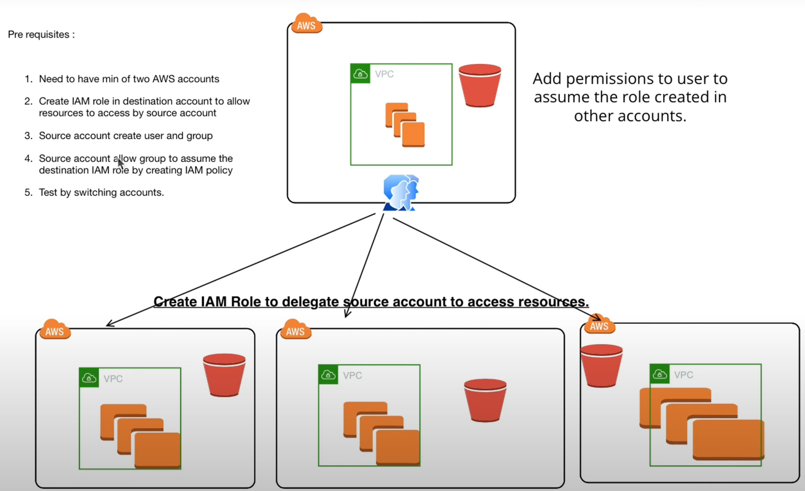

## AWS Cross Accounts & Assume Role
Lab:
- Create at least 2 AWS account: account A and account B
- Create an IAM role *S3AccessOnly* in account B to allow access to resources through the account A
- Create a user *johnsmith* and group *developer* in account A
- Allow the group *developer* in account A to assume the IAM role *S3AccessOnly* in account B by creating an IAM policy
- Test by switching accounts.

[Video](https://youtu.be/Xo-7VySEm7o?si=nNihWz5JKvd1ak-y)

